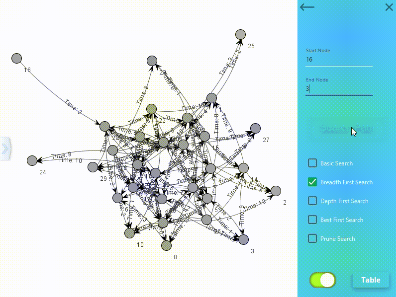

# Brain Game

Welcome to the BrainGame. BrainGame is a simulation for various path searching algorithms. 
The list of path searching algorithm covered in this program are:
1. Basic Search (Brute-Force)
2. Breath First Search
3. Depth First Search
4. Best First Search
5. Pruning Search
6. Genetic Algorithm

## Getting Started

**This program only compatible with JavaSE 1.8**

Here is a guideline to help you get started to run this program.
1. Clone this repository
2. Run the main method in src/BrainGame.java

** *No project management such as Maven and Gradle is used in this project, all libraries used are provided as jar files in `lib/` folder*

## Folder Structure

The workspace contains two folders by default, where:

- `src`: the folder to maintain sources
- `lib`: the folder to maintain dependencies

Meanwhile, the compiled output files will be generated in the `bin` folder by default if VS Code is used.

## Simulation

Nodes created and listed in table

Sample Breath First Search

Sample Genetic Algorithm Search

